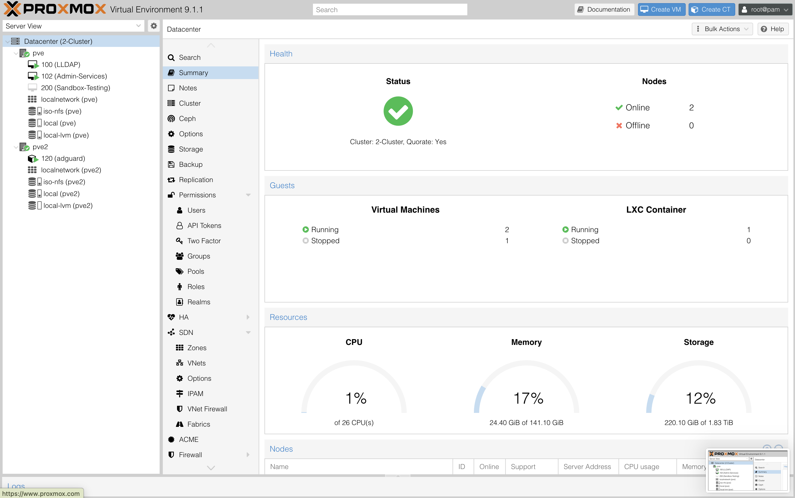
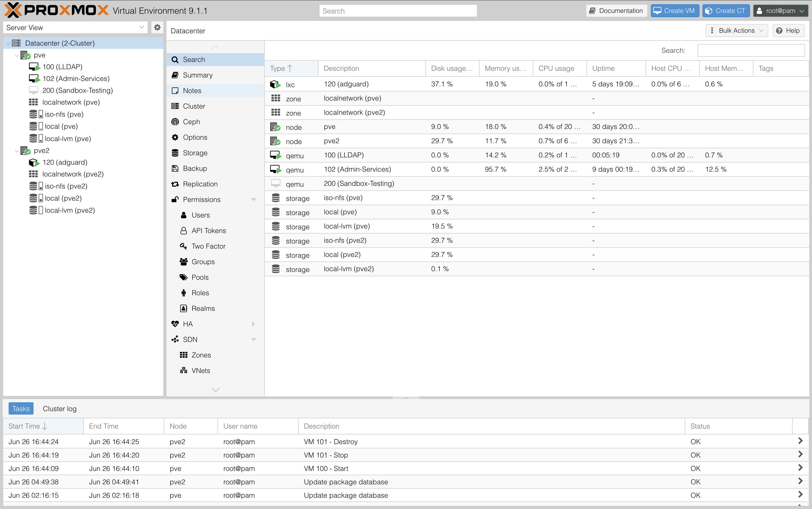
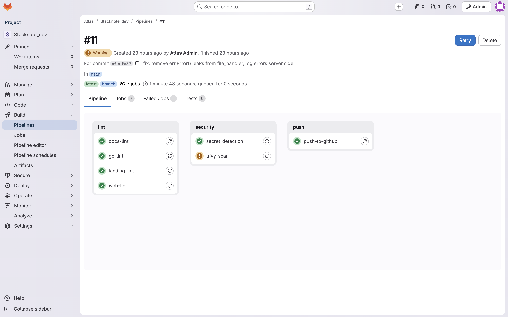

# Atlas  Self Hosted Private Cloud


**Started: February 21, 2026 | Status: Active**

A self hosted private cloud built on a two node Proxmox 
cluster with bare metal pfSense networking, running 
production grade services with automated CI/CD and 
centralized DNS filtering.

---

## Current Infrastructure

```
Physical Layer
├── pfSense (bare metal)
│   Firewall | Routing | Tailscale VPN
│   ├── WAP — Wireless access
│   └── Switch — Network switching
│
├── PVE — Primary Compute Node
│   Hardware: i7 | RTX 3060 | 128GB RAM
│   └── VM 102 — Admin Services
│       ├── GitLab (Docker)
│       ├── Nginx (Docker)
│       └── Nextcloud (Docker)
│
└── PVE2 — Operations Node
    Hardware: Mac Mini 2018 | 16GB RAM
    ├── LXC 120 — AdGuard (DNS filtering)
    └── NFS — Shared ISO storage
```

---

## Stack

| Layer | Technology | Status |
|-------|-----------|--------|
| Hypervisor | Proxmox VE | Running |
| Firewall | pfSense (bare metal) | Running |
| VPN | Tailscale | Running |
| DNS | AdGuard (LXC) | Running |
| Reverse Proxy | Nginx | Running |
| VCS and CI/CD | Self hosted GitLab | Running |
| File Storage | Nextcloud | Running |
| Shared Storage | NFS | Running |
| Orchestration | K3s Kubernetes | In Progress |
| Monitoring | Prometheus + Grafana + Loki | In Progress |
| IaC | Terraform | In Progress |
| Automation | Ansible | In Progress |
| Backups | Automated NFS | In Progress |
| Identity | LLDAP | Planned |

---

## Services

**GitLab**
Self hosted GitLab instance with configured CI/CD runners
using Docker executor. Pipelines include lint, security
scanning via Trivy, secret detection, and automatic
GitHub mirroring on passing builds.

**Nginx**
Reverse proxy routing external traffic to internal
services with SSL termination.

**Nextcloud**
Self hosted file storage and collaboration platform.

**AdGuard**
Network wide DNS filtering running as LXC container
on PVE2. Provides ad blocking and DNS resolution
for all network devices.

**NFS**
Network file system sharing ISO images across PVE1
and PVE2 for VM provisioning.

---

## Screenshots

### Network Topology

*Network design — segmented guest and trusted 
device zones, bare metal pfSense firewall, 
two node Proxmox cluster*

### Cluster Health

*Two node Proxmox cluster — healthy, quorate, 
2 nodes online, 0 offline*

### Datacenter Overview

*Full cluster view — VMs, LXC containers, and 
shared NFS storage across pve and pve2*

### GitLab CI Pipeline  

*Automated pipeline — lint across monorepo components, Trivy security scan, Secret detection, automatic GitHub mirror on passing build*

---

## Key Technical Decisions

**Bare metal pfSense over virtualized firewall**
Running pfSense on dedicated hardware ensures firewall
performance is never affected by VM resource contention.
A virtualized firewall shares resources with workloads —
unacceptable for a security critical component.

**Two node Proxmox cluster**
Separated primary compute (PVE1) from operations (PVE2).
PVE1 runs production services. PVE2 runs DNS, monitoring,
and backups. Mirrors management plane vs data plane
separation used in production infrastructure.

**Self hosted GitLab over GitHub Actions**
Wanted hands on experience operating a production GitLab
instance. Configured Docker executor runners, Trivy
security scanning, secret detection, and automatic
GitHub mirroring. GitLab CI pushes to GitHub only
after all checks pass.

**Tailscale on pfSense**
Installed Tailscale directly on pfSense providing
encrypted remote access to entire network without
exposing individual services to public internet.

**AdGuard on dedicated LXC on PVE2**
Separated DNS from primary compute node. Network wide
DNS filtering runs independently of PVE1 workloads.
DNS resolution remains available even if PVE1 is down.

**NFS for cluster wide storage**
Configured NFS on PVE2 for shared ISO image storage
across both Proxmox nodes. Eliminates duplicate ISO
storage and ensures both nodes provision VMs from
the same images.

**Proxmox cluster with quorum over independent nodes**
Configured PVE and PVE2 as a proper Proxmox cluster 
with quorum enabled rather than two independent nodes. 
Quorum prevents split brain scenarios — if one node 
loses connectivity the cluster protects data integrity 
by stopping new VM operations until quorum is restored.

---

## Challenges and Solutions

**Proxmox cluster quorum with two nodes**
Two node clusters require careful quorum configuration. 
With only two nodes losing one node loses quorum and 
halts cluster operations. Mitigated by ensuring PVE2 
runs only non-critical observability workloads so 
losing PVE2 does not affect production services on PVE.

**GitLab external URL misconfiguration**
GitLab returning incorrect clone URLs after initial
setup. Diagnosed via gitlab-ctl status and
/etc/gitlab/gitlab.rb review. Fixed by setting
external_url to match actual domain and running
gitlab-ctl reconfigure.

**AdGuard DNS latency on PVE2**
Mac Mini 2018 with 16GB RAM causes occasional DNS
resolution latency under load. Currently monitoring
query response times via AdGuard query log and
evaluating resource allocation adjustments.

**Service consolidation debt**
All Docker services currently running on single Ubuntu
Server VM on PVE1. Planned remediation is separating
admin services onto dedicated Admin VM and workload
services onto dedicated Workload VM before K3s
migration.


---

## What I Learned

- Bare metal firewall configuration requires understanding
  physical network topology before touching any software
  — spent significant time mapping pfSense interfaces
  to physical ports before any rules were configured
- Self hosting GitLab revealed operational complexity
  that GitHub abstracts away, runner registration,
  executor configuration, resource limits, and external
  URL configuration all require explicit decisions
- NFS setup across two Proxmox nodes exposed networking
  fundamentals, NFS relies on stable IP addressing,
  which required static IP configuration on both nodes
  before NFS mounts would survive reboots
- Two node cluster design forced thinking about failure
  modes, what happens to DNS if PVE2 goes down, what
  happens to services if PVE1 goes down

---

## Roadmap

### Phase 1 — Cluster Restructure (Current)
- [x] Backup GitLab and Nextcloud to NFS
- [x] Create Admin VM on PVE1 with LLDAP
- [x] Write Ansible playbooks for VM provisioning | Used `k3s-ansible` from `k3s-io`'s [github]("https://github.com/k3s-io/k3s-ansible")
- [x] Write Terraform configs for cluster infrastructure
- [x] Create k3s-main control plane VM on PVE1
- [x] Create k3s-worker-01 workload VM on PVE1
- [x] Create k3s-worker-03 observability VM on PVE2

### Phase 2 — Kubernetes Deployment
- [x] Deploy K3s across both Proxmox nodes via 
      Ansible and Terraform
- [x] Join k3s-worker-01 and k3s-worker-03 as agents
- [ ] Migrate GitLab to K3s via Helm
- [ ] Migrate Nextcloud to K3s
- [ ] Configure Nginx ingress controller

### Phase 3 — Operations Layer
- [ ] Deploy Prometheus on k3s-worker-03 via Helm
- [ ] Deploy Grafana on k3s-worker-03 via Helm
- [ ] Deploy Loki on k3s-worker-03 via Helm
- [ ] Terraform for cluster wide IaC on PVE2
- [ ] LLDAP authentication for GitLab and Nextcloud
- [ ] Automated backup pipeline to NFS external USB
- [ ] AlertManager for proactive alerting

### Phase 4 — Advanced
- [ ] GPU passthrough on k3s-worker-02
- [ ] NVIDIA device plugin for GPU scheduling
- [ ] WireGuard mesh networking
- [ ] Zipkin distributed tracing for 
      cross-service request visibility

---

## Changelog

Significant changes recorded starting June 5th 2026.
See [ISSUES.md](./ISSUES.md) for known issues.
