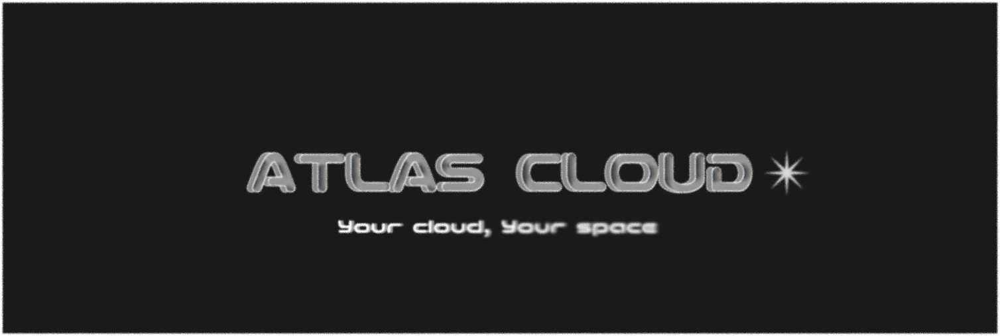

## Official Start Date: Febuary 21 2026 | Last updated: Friday June 6th 2026

Simplle self preseverd infrastructure as code, enabling user to run multiple services in a secured environment. Documentation is provided below, updated regularly.

### DISCLAIMER

Any and All changes done, starting Friday June 5th 2026, will be recorded for learning and tracking purposes. This the official documentation of setting up your own cloud with different types of services

## How to use ATLAS

### What you can expect

You can expect a multitude of hands on knowledge. We will not teach you any important fundamentals related to this project (ex. Binary conversions for networking, etc...), you are expected to either learn by doing or having previous knowledge. The following of hands on skills and knowledge you will learn through this repo:

- OS Installation and their requirements
    - Types of OS Installation
    - Filesystem Basics
    - Virtualization Basics
    - Setting up VMS
    - VM vs Containers
- Networking
    - Setting up STATIC IP
    - Checking network communication betweend endpoints
    - DNS
    - TCP/UDP
    - DMZ
    - VPN
    - Shared Folders
    - Firewall rules
- Linux
    - Most used & useful linux commands
- Bare metal vs Digitized (Software)
    - Firewall (PfSense | Baremetal)
    - Firewall (PfSense | Containerized Service Software) 
    - Desktop (Proxmox | OS/Software )
- Orchestration, Observability & Monitoring
    - Terraform | Infrastructure as Code
    - Docker | Containerization
    - Distrobox | OS environment Containerization
        - Podman 
        - Docker
    - Prometheus & Grafana | System monitoring & Observability
    - Kubernetes
- Identity and Access Management
    - Active Directory
- Hosted Services
    - Gitlab
    - Open WebUI
    - LocalSend
    - AppFlowy
    - Immich (Storage Image/Video) / Stacknote (Storage of all kind)
    - Dokploy

### Recommended Usage

We do heavily encourage you to actually learn by doing doing/research, minimal description will be given due to that fact. This repo is only meant to get you started to a bare minimum level. This being said, it also does represent how we are deploying, maintaining services. 

### Certifications & Training

As we move along we plan to release related certifications & training that aids in deep understanding of hands on material. Certifications aren't useful by itself, by applying knowledge from certain coursework, training, certification, you gain both theoritical and hands on knowledge. The following certs that are useful:

| Updated on Friday 5th June 2026 
- CompTIA A+ (Basic Computer Hardware,Configuration, Management)
