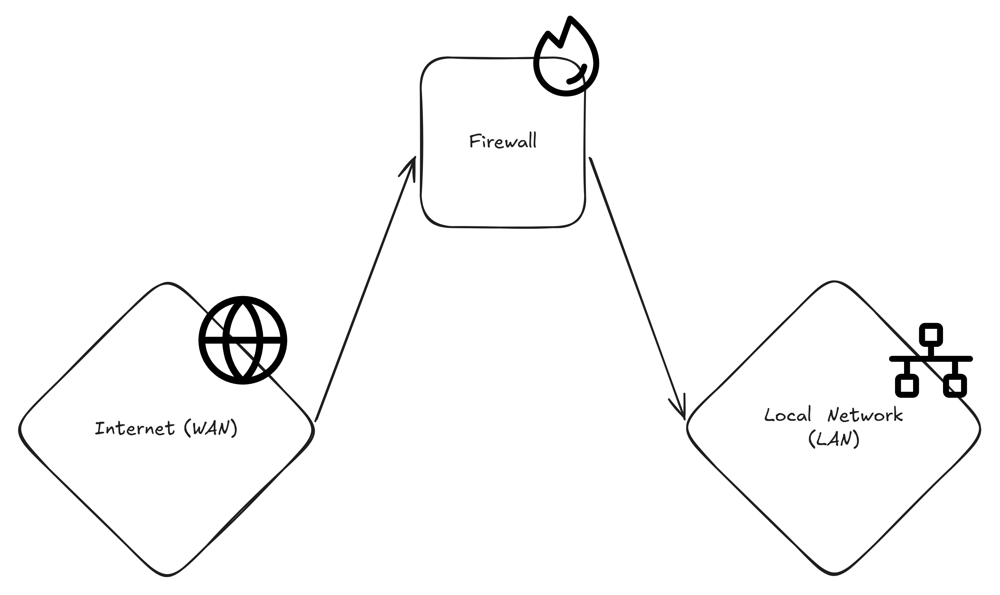

# Defining Firewall

A Firewall (software or hardware based) is a set a rules that governs how traffic occurs on our network.

# Two Kind of Traffic
- Ingress Traffic | Internet to PC (Data coming INTO your network, Ex. Downloading a game from steam)
- Egress Traffic  | Pc to Internet (Data going OUT OF your network, Ex. Sending an Email)

# Where do firewall sit logcially (where is it located it?)
Your firewall is considered to be the middleman of both your Local Area Network (Your Local Network) and your Wide Area Network (The Internet Network). A visual representation of statement is shown.

