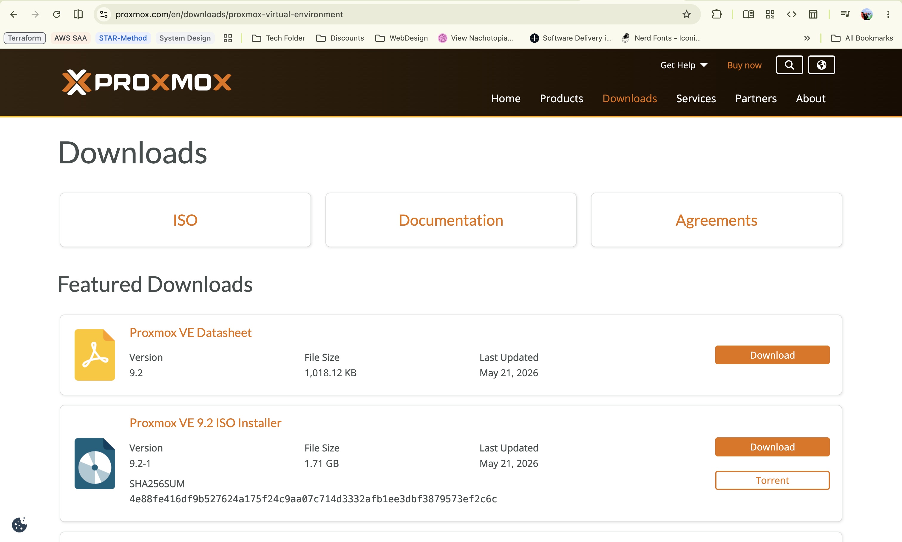
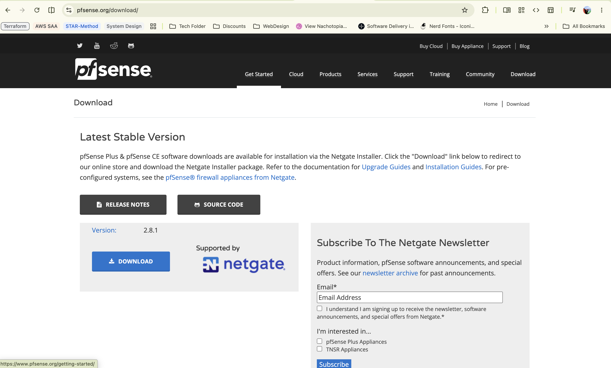

# Installation

## Proxmox Installation Process
For the Proxmox this section will be broken down into 2 sections, REQUIRED and OPTIONAL.

### Required
- You will need a USB Stick (Preferably USB3.0)
- Go to the official Proxmox [Download Page](https://www.pfsense.org/download/)

- Install [rufus](https://rufus.ie/en/) to install/Flash PfSense Iso Image unto your USB Stick  
- Go through the Installation Process [0:00 - 3:00](https://www.youtube.com/watch?v=lFzWDJcRsqo)

### Optional
This one is a little bit trickier since you would have to Disable T2 Secure Boot. PLEASE DO NOT MESS THIS UP. It took me hours and hours to figure out how to fix my own mistake, unless you want to shoot yourself in the foot and patch with bandaid later, you do not want to skip this step if you really are using a Mac mini Intel 2018.

I wrote a document a little while back ago which may help you disable T2 Secure Boot starting from `STEP 4 - Onward`. 

[REFER TO THIS ARTICLE](https://gist.github.com/JonathanEveillard/8e80c5f4fc0cc69dc73c3b0b15390a9d)

- Procceed installation from Article

## PfSense Installation Process - Baremetal Mini Pc (Protectli vault)
- You will need a USB Stick (Preferably USB3.0)
- Go to the official PfSense [Download Page](https://www.pfsense.org/download/)

- Install [rufus](https://rufus.ie/en/) to install/Flash PfSense Iso Image unto your USB Stick  
- Go through the Installation Process | Louis Rossman has a good guide from [0:00 - 25:27](https://www.youtube.com/watch?v=Et5PPMYuOc8)

